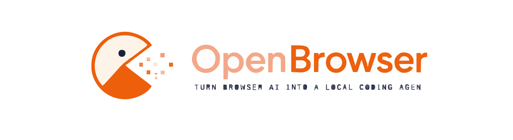

<div align="center">
  
  <h1 align="center">OpenBrowser Website</h1>

  <p align="center">
    <strong>The official standalone marketing and documentation website for the OpenBrowser ecosystem.</strong>
  </p>

  <p align="center">
    <a href="https://github.com/openbrowser/website/actions"></a>
    <a href="https://nextjs.org"></a>
    <a href="https://react.dev"></a>
    <a href="https://tailwindcss.com"></a>
    <a href="https://github.com/openbrowser/website/blob/main/LICENSE"></a>
  </p>
</div>

---

## Table of Contents

- [About](#about)
- [Features](#features)
- [Technology Stack](#technology-stack)
- [Folder Structure](#folder-structure)
- [App Router Structure](#app-router-structure)
- [Component Architecture](#component-architecture)
- [Styling System](#styling-system)
- [Documentation System](#documentation-system)
- [Performance](#performance)
- [SEO](#seo)
- [Accessibility](#accessibility)
- [Installation](#installation)
- [Deployment](#deployment)
- [Configuration Files](#configuration-files)
- [Assets](#assets)
- [Contributing](#contributing)
- [Roadmap](#roadmap)
- [FAQ](#faq)
- [Troubleshooting](#troubleshooting)
- [Repository Overview](#repository-overview)
- [Developer Notes](#developer-notes)
- [License](#license)

---

## About

This repository contains **only** the OpenBrowser marketing and documentation website. It is a completely standalone Next.js 15 application. 

> [!IMPORTANT]
> **What this repository is NOT:**
> - This is NOT the OpenBrowser CLI.
> - This is NOT the OpenBrowser Chrome Extension.
> - This is NOT the Fastify Bridge Server.
> - This is NOT the core OpenBrowser operations engine.

This project was intentionally extracted from the original OpenBrowser monorepo to isolate the documentation and marketing assets, ensuring maximum performance, reduced dependency bloat, and a pristine deployment pipeline. The website operates exclusively as a frontend layer and possesses **zero runtime dependencies** on local backend services, bridging servers, or monorepo packages.

---

## Features

The OpenBrowser website is designed to be a premium, highly responsive, and accessible experience:

- **Landing Page:** A high-conversion homepage with an interactive terminal showcase, feature highlights, and animated community sections.
- **Features Showcase:** Deep dive into the core capabilities (Local File Editing, Diff Previews, etc.).
- **AI Providers:** Visual grids representing supported providers like ChatGPT, Claude, and Gemini.
- **System Architecture:** A world-class visual walkthrough of OpenBrowser's internal architecture, featuring responsive flow diagrams and timeline components.
- **Documentation Engine:** A robust, MDX-powered documentation system featuring static generation, sidebars, active link tracking, and code syntax highlighting via Shiki.
- **Blog:** A static blog system for ecosystem updates and announcements.
- **Dark/Light Mode:** First-class support for `next-themes` with seamless transitions and system preference detection.
- **Responsive Design:** Fluid layouts optimized for everything from ultra-wide desktops to mobile devices.
- **SEO & Metadata:** Comprehensive metadata, OpenGraph cards, Twitter cards, and structured JSON-LD integration.
- **Animations:** Subtle, performant micro-interactions and scroll-reveals powered by Framer Motion.
- **Accessibility (a11y):** Strict adherence to WCAG standards, utilizing Radix/shadcn primitives for screen readers and keyboard navigation.
- **Performance:** Optimized bundle sizes via `optimizePackageImports`, lazy-loaded components, and Next.js Image optimization.
- **FAQ:** An integrated, accordion-based FAQ section addressing common developer queries.
- **Terminal Showcase:** A highly interactive, animated terminal component simulating the OpenBrowser CLI experience.
- **Component Library:** Built atop Tailwind CSS and shadcn/ui for maintainable, reusable, and tokenized UI primitives.

---

## Technology Stack

The project relies on a modern, robust, and highly-typed frontend stack:

- **[Next.js 15](https://nextjs.org):** Utilized for its App Router, Server Components (where applicable), highly optimized static generation, and robust routing infrastructure.
- **[React 19](https://react.dev):** The foundational UI library leveraging the latest concurrent features and compiler optimizations.
- **[TypeScript](https://www.typescriptlang.org):** Ensures end-to-end type safety, reliable refactoring, and superior developer experience.
- **[Tailwind CSS (v3)](https://tailwindcss.com):** Provides utility-first styling, design token enforcement, and responsive design capabilities without heavy CSS-in-JS runtime overhead.
- **[Framer Motion](https://www.framer.com/motion):** Drives complex scroll-based animations, layout transitions, and interactive components.
- **[MDX](https://mdxjs.com):** Combines Markdown with JSX to create interactive and visually appealing documentation pages.
- **[Lucide Icons](https://lucide.dev):** A clean, modern, and lightweight SVG icon library.
- **[next-themes](https://github.com/pacocoursey/next-themes):** Manages the complex logic of Theme/Dark Mode toggling while preventing hydration mismatches.
- **[ESLint & Prettier]:** Enforces strict code quality, formatting consistency, and best practices.
- **[PostCSS]:** The underlying engine that processes Tailwind utilities into static CSS.

---

## Folder Structure

```text
website/
├── app/                  # Next.js App Router (Pages, Layouts, Routing)
├── components/           # Reusable React components
│   ├── architecture/     # Specialized diagrams for the Architecture page
│   └── ui/               # Base shadcn/ui primitives (buttons, dialogs, etc.)
├── content/              # MDX files for Documentation and Blog posts
├── hooks/                # Custom React hooks (e.g., use-media-query)
├── lib/                  # Utility functions (e.g., utils.ts for Tailwind merging)
├── public/               # Static assets (images, logos, fonts, SVGs)
├── styles/               # Global CSS files (globals.css)
├── mdx-components.tsx    # MDX rendering configuration
├── next.config.mjs       # Next.js configuration and plugins
├── package.json          # Dependencies and scripts (npm)
├── postcss.config.js     # PostCSS configuration for Tailwind
├── tailwind.config.ts    # Tailwind CSS configuration and themes
└── tsconfig.json         # TypeScript compiler configuration
```

### Responsibilities
- `app/`: Dictates the route structure and page-level metadata.
- `components/`: Handles the visual presentation and interactivity. Contains no direct routing logic.
- `content/`: Acts as the "database" for the static site. All written documentation lives here.
- `styles/`: Centralizes the Tailwind base layers, components, and global variables.

---

## App Router Structure

Next.js App Router utilizes the file system to define the application's URL structure.

- `/` (`app/page.tsx`): The main landing page.
- `/features`: Deep dive into core features.
- `/how-it-works`: Step-by-step onboarding guide.
- `/providers`: Supported AI provider showcase.
- `/docs`: The entry point for MDX documentation.
- `/blog`: Blog listing and dynamic individual post routes.
- `/architecture`: The premium, animated system architecture walkthrough.
- `/_not-found` (`app/not-found.tsx`): Custom 404 error page.
- `robots.ts`: Dynamically generates `robots.txt` for search engines.
- `sitemap.ts`: Dynamically generates `sitemap.xml` mapping all valid routes.
- `layout.tsx`: The root layout applying the Theme Provider, Navbar, and Footer across the entire site.

---

## Component Architecture

The website employs a strictly modular component architecture.

### Global Layout
- **Navbar (`navbar.tsx`):** Responsive top navigation featuring sticky positioning, backdrop filters, active route highlighting, and mobile hamburger menus.
- **Footer (`footer.tsx`):** Comprehensive footer with site links, social icons, and newsletter/CTA sections.
- **Theme Toggle (`theme-toggle.tsx`):** A lightweight button interacting with `next-themes` to switch between dark, light, and system modes.
- **Theme Provider (`theme-provider.tsx`):** Wraps the application to inject CSS variables dynamically based on user preference.

### Page Sections
- **Hero (`hero.tsx`):** High-impact entry section with prominent typography, animated gradients, and primary calls to action.
- **Interactive Terminal (`interactive-terminal.tsx`):** A complex, state-driven component using Framer Motion to simulate a CLI typing experience, complete with syntax highlighting and sequential steps.
- **Features Grid (`features-grid.tsx`):** Displays capabilities using responsive CSS grids and hover-scaling cards.
- **Comparison Table (`comparison-table.tsx`):** A data-dense, responsive table highlighting OpenBrowser's advantages over traditional AI tools.
- **Providers Grid (`providers-grid.tsx`):** Logo grids showcasing integrations with ChatGPT, Claude, etc.
- **FAQ (`faq-accordion.tsx`):** Accessible, collapsible question/answer blocks built on Radix UI primitives.
- **CTA Banner (`cta-banner.tsx`):** Reusable section designed to drive conversions and GitHub stars at the bottom of pages.

### Architecture Page Subcomponents
Located in `components/architecture/`:
- **Bridge Architecture Diagram:** Visualizes the Fastify SSE bridge.
- **Streaming Pipeline:** Animates the flow of tokens from the Browser Extension to the CLI.
- **Request Lifecycle:** An interactive timeline revealing steps as the user scrolls.
- **Response Processing:** Visualizes the Zod parsing and diff generation pipeline.

---

## Styling System

The project uses Tailwind CSS v3 as its primary styling engine.

- **`globals.css`:** Defines the base Tailwind directives (`@tailwind base; @tailwind components; @tailwind utilities;`) and establishes the CSS variables (e.g., `--background`, `--foreground`, `--primary`) used by the theme system.
- **Design Tokens:** All colors, spacing, and typography are tokenized in `tailwind.config.ts`. We avoid hardcoded hex values in favor of semantic classes (`bg-background`, `text-primary`).
- **Dark Mode:** Implemented via the `class` strategy in Tailwind. The `next-themes` provider toggles the `.dark` class on the `<html>` element, causing CSS variables in `globals.css` to instantly update without hydration flashes.
- **Component Variants:** We utilize utility functions like `clsx` and `tailwind-merge` (`cn()` in `lib/utils.ts`) to cleanly compose and override classes in reusable components.

---

## Documentation System

Documentation is powered by `@next/mdx` and static file generation.

- **Content:** Written entirely in `.mdx` files stored in `content/`.
- **Parsing:** Handled by Next.js plugins defined in `next.config.mjs` (`remark-gfm` for tables/strikethrough, `rehype-slug` for anchor links).
- **Syntax Highlighting:** Powered by `rehype-pretty-code` and `shiki`, generating beautiful, accessible, and static code blocks at build time.
- **Docs Layout:** Features a persistent `DocsSidebar` for navigation, a main content area with optimized typography (`prose prose-invert`), and a `DocsPager` for navigating to previous/next articles.
- **Copy Button:** Custom `copy-button.tsx` injected into code blocks to allow users to easily copy CLI commands to their clipboard.

---

## Performance

Performance is a first-class citizen in this repository.

- **Lazy Loading:** Heavy animations (like Framer Motion) are wrapped in `LazyMotion` and `domAnimation` features to drastically reduce the initial JavaScript payload.
- **Dynamic Imports:** Non-critical, below-the-fold components (like the Interactive Terminal) utilize `next/dynamic` to split code and defer loading until necessary.
- **Image Optimization:** All assets utilize `next/image` to automatically generate WebP variants, serve responsive sizes via `srcset`, and prevent Cumulative Layout Shift (CLS) through explicit dimensions.
- **Bundle Optimization:** `optimizePackageImports` is enabled in `next.config.mjs` for libraries like `lucide-react`, ensuring only the specifically imported icons are bundled.

---

## SEO

Search Engine Optimization is strictly enforced via Next.js Metadata APIs.

- **Metadata:** Every page exports a `metadata` object defining specific titles and descriptions.
- **OpenGraph & Twitter Cards:** Configured globally in `layout.tsx` to ensure rich link previews across social media, iMessage, and Slack.
- **Robots & Sitemap:** Dynamically generated via `robots.ts` and `sitemap.ts` to guide web crawlers and index the site efficiently.
- **Semantic HTML:** Strict adherence to proper `<main>`, `<article>`, `<section>`, `<nav>`, and heading hierarchies (`h1` -> `h2` -> `h3`).

---

## Accessibility

- **Keyboard Navigation:** All interactive elements (`<button>`, `<a>`, forms) possess highly visible focus rings (`focus-visible:ring`).
- **ARIA:** Proper `aria-labels`, `aria-expanded`, and `aria-hidden` attributes are utilized on complex UI components like accordions and mobile menus.
- **Contrast:** Colors defined in the Tailwind config undergo strict contrast ratio checks to ensure readability in both light and dark modes.

---

## Installation

### Requirements
- **Node.js**: v18.17.0 or higher
- **npm**: v9.0.0 or higher

> [!WARNING]
> This repository uses **npm exclusively**. Do not use `pnpm` or `yarn` as they will generate conflicting lockfiles.

### Local Development

1. Clone the repository:
   ```bash
   git clone https://github.com/openbrowser/website.git
   cd website
   ```

2. Install dependencies:
   ```bash
   npm install
   ```

3. Start the development server:
   ```bash
   npm run dev
   ```

4. Open your browser and navigate to `http://localhost:3000`.

### Production Build

To test the production build locally:

```bash
# Important: Stop the dev server before running the build command
npm run build
npm start
```

### Linting

```bash
npm run lint
```

---

## Deployment

This standalone Next.js application requires zero custom build configuration for modern hosting platforms.

### Vercel (Recommended)
1. Push your code to GitHub.
2. Import the repository into Vercel.
3. Vercel will automatically detect Next.js, run `npm run build`, and deploy the application to their Edge Network.

### Netlify
The repository includes a `netlify.toml` file to ensure smooth deployment on Netlify. It automatically configures the build command (`npm run build`) and publish directory (`.next`).

### Environment Variables
Currently, the website requires **no environment variables** to build or deploy successfully.

---

## Configuration Files

- **`package.json`**: Defines standard npm scripts (`dev`, `build`, `start`, `lint`) and explicitly lists all dependencies. Contains no monorepo workspaces.
- **`tsconfig.json`**: Standard Next.js strict TypeScript configuration, defining path aliases (e.g., `@/*` mapping to `./*`).
- **`tailwind.config.ts`**: The styling brain. Configures content paths, custom theme tokens (colors, animations, container sizes), and the `@tailwindcss/typography` plugin.
- **`postcss.config.js`**: Instructs the build pipeline to process Tailwind CSS and Autoprefixer.
- **`next.config.mjs`**: Enables MDX support, configures `pageExtensions`, and manages experimental package optimizations.
- **`netlify.toml`**: Baseline configuration for Netlify continuous deployment.

---

## Assets

All static assets are located in the `/public` directory.
- `logo.svg`: The primary OpenBrowser vector logo.
- `favicon.svg` / `icon.svg`: High-resolution icons used in the browser tab.
- `images/`: Any screenshots or illustrations utilized in documentation or marketing pages.
- *Note: Avoid uploading massive PNGs or JPEGs. Always utilize SVGs or WebP formats where possible.*

---

## Contributing

We welcome contributions to the OpenBrowser website!

### Coding Standards
- Use **TypeScript** for all new files.
- Prefer **React Server Components** by default. Only add `"use client"` at the top of a file if it requires state (`useState`), effects (`useEffect`), or browser APIs.
- Utilize the `cn()` utility from `lib/utils.ts` when conditionally merging Tailwind classes.

### Formatting & Commits
- Run `npm run lint` before committing to ensure there are no ESLint errors.
- Ensure Prettier formatting is applied.
- Write descriptive commit messages (e.g., `feat(docs): add new installation guide`, `fix(ui): correct mobile padding on hero section`).

### Issue Reporting
If you find a broken link, a typo, or a styling bug, please open an issue describing the expected behavior vs. the actual behavior, and include screenshots if possible.

---

## Roadmap

Planned improvements for the website:
- **Search Integration:** Implement Algolia DocSearch for instant documentation lookups.
- **Analytics:** Integrate privacy-focused analytics (e.g., Vercel Analytics or Plausible) to track page views.
- **Internationalization (i18n):** Add routing support for multiple languages (e.g., `/en/docs`, `/es/docs`).
- **Enhanced MDX:** Add custom MDX components for warnings, tabs, and interactive API playgrounds.

---

## FAQ

**Q: Can I run this website if I don't have the OpenBrowser CLI installed?**
A: Yes! This repository is entirely decoupled from the core product. It is just a Next.js website.

**Q: Why is my `npm run dev` server crashing with `ENOENT .next/routes-manifest.json`?**
A: You likely ran `npm run build` in another terminal while the dev server was active. `next build` deletes the `.next` directory. Stop your dev server, run the build, and then restart the dev server.

**Q: Where is the backend code?**
A: The OpenBrowser backend and CLI exist in a separate repository. This repo is strictly for the frontend website.

---

## Troubleshooting

### Port Conflicts
If port `3000` is already in use, Next.js will ask to use a different port (e.g., `3001`). Alternatively, force a port using `npm run dev -- -p 4000`.

### Tailwind Classes Not Updating
Ensure the file you are editing is included in the `content` array inside `tailwind.config.ts`. If it is a new folder, you must add it to the configuration array.

### Node Version Errors
If you experience strange build errors, verify you are running Node v18.17.0 or higher. You can check your version by running `node -v`.

---

## Repository Overview

```mermaid
graph TD
    A[User Request] --> B{Next.js App Router}
    B --> C[Static Pages /page.tsx]
    B --> D[MDX Docs /content/*.mdx]
    
    C --> E[Server Components]
    E --> F[Client Components 'use client']
    
    D --> G[@next/mdx Pipeline]
    G --> H[rehype-pretty-code]
    
    F --> I[Framer Motion]
    F --> J[React Hooks]
    
    E --> K[Tailwind CSS]
    F --> K
```

### Rendering Pipeline
The website heavily prioritizes **Static Site Generation (SSG)**. At build time, Next.js crawls all routes (including dynamic blog posts and MDX files) and generates optimized static HTML payloads. Client-side JavaScript is only shipped for interactive components (marked with `"use client"`), resulting in near-instant load times and exceptional Core Web Vitals.

---

## Developer Notes

- **Keep it simple:** Do not over-engineer components. If a section is static, keep it as a Server Component.
- **Don't touch `package-lock.json` manually:** Always use `npm install <package>` to manage dependencies.
- **SVGs over PNGs:** Always prefer SVGs for icons and illustrations to ensure infinite scaling and minimal file sizes.
- **Avoid Global CSS:** With the exception of root CSS variables in `globals.css`, write all styling directly inline using Tailwind utility classes to ensure dead-code elimination.

---

## Credits

- Built with [Next.js](https://nextjs.org) by Vercel.
- Styled with [Tailwind CSS](https://tailwindcss.com).
- UI Primitives heavily inspired by [shadcn/ui](https://ui.shadcn.com).
- Syntax highlighting powered by [Shiki](https://shiki.style).

---

## License

This project is licensed under the MIT License. See the [LICENSE](./LICENSE) file for more details.
